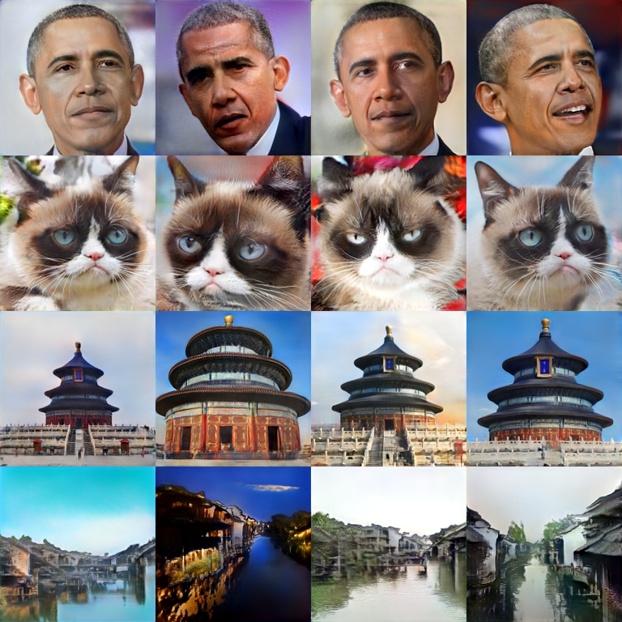

## Commonality in Natural Images Rescues GANs: Pretraining GANs with Generic and Privacy-free Synthetic Data<br/>(CVPR 2022)

> **_Potentials of primitive shapes for representing things. We only use a line, ellipse, and rectangle to express a cat and a temple. These examples motivate us to develop Primitives, which generates the data by a simple composition of the shapes._**

__Official pytorch implementation of "Commonality in Natural Images Rescues GANs: Pretraining GANs with Generic and Privacy-free Synthetic Data"__

> __[Commonality in Natural Images Rescues GANs: Pretraining GANs with Generic and Privacy-free Synthetic Data](https://arxiv.org/abs/2204.04950)__   
> [Kyungjune Baek](https://scholar.google.co.kr/citations?hl=ko&user=jC6P1pQAAAAJ) and [Hyunjung Shim](https://scholar.google.co.kr/citations?user=KB5XZGIAAAAJ&hl=ko)
>
> Yonsei University  
>  
> __Absract__ _Transfer learning for GANs successfully improves generation performance under low-shot regimes. However, existing studies show that the pretrained model using a single benchmark dataset is not generalized to various target datasets. More importantly, the pretrained model can be vulnerable to copyright or privacy risks as membership inference attack advances. To resolve both issues, we propose an effective and unbiased data synthesizer, namely Primitives-PS, inspired by the generic characteristics of natural images. Specifically, we utilize 1) the generic statistics on the frequency magnitude spectrum, 2) the elementary shape (i.e., image composition via elementary shapes) for representing the structure information, and 3) the existence of saliency as prior. Since our synthesizer only considers the generic properties of natural images, the single model pretrained on our dataset can be consistently transferred to various target datasets, and even outperforms the previous methods pretrained with the natural images in terms of Fr\'echet inception distance. Extensive analysis, ablation study, and evaluations demonstrate that each component of our data synthesizer is effective, and provide insights on the desirable nature of the pretrained model for the transferability of GANs._

## Requirement 
__Environment__

For the easy construction of environment, please use the docker image.

* Replace $DOCKER_CONTAINER_NAME, $LOCAL_MAPPING_DIRECTORY, and $DOCKER_MAPPING_DIRECTORY to your own name and directories.
```
nvidia-docker run -it --entrypoint /bin/bash --shm-size 96g --name $DOCKER_CONTAINER_NAME -v $LOCAL_MAPPING_DIRECTORY:$DOCKER_MAPPING_DIRECTORY bkjbkj12/stylegan2_ada-pytorch1.8:1.0

nvidia-docker start $DOCKER_CONTAINER_NAME
nvidia-docker exec -it $DOCKER_CONTAINER_NAME bash
```
Then, go to the directory containing the source code

__Dataset__

The low-shot datasets are from [DiffAug](https://github.com/mit-han-lab/data-efficient-gans) repository.

__Pretrained checkpoint__

Please download the source model (pretrained model) [below](#pretrained-model). (Mainly used Primitives-PS)

__Hardware__
* Mainly tested on Titan XP (12GB), V100 (32GB) and A6000 (48GB).

## How to Run (Quick Start)

__Pretraining__
To change the type of the pretraining dataset, comment out ant in these lines: [lines](https://github.com/FriedRonaldo/Primitives-PS/blob/main/pretrain/noise_dataset.py#L227).

The file "noise.zip" is not required. (Just running the script will work well.)
```
CUDA_VISIBLE_DEVICES=$GPU_NUMBER python train.py --outdir=$OUTPUT_DIR --data=./data/noise.zip --gpus=1
```

__Finetuning__
Change or locate the pretrained pkl file into the directory specified at the [code](https://github.com/FriedRonaldo/Primitives-PS/blob/main/finetune/train.py#L345).
```
CUDA_VISIBLE_DEVICES=$GPU_NUMBER python train.py --outdir=$OUTPUT_DIR --gpus=1 --data $DATA_DIR --kimg 400 --resume $PKL_NAME_TO_RESUME
```

__Examples__
```
Pretraining:
CUDA_VISIBLE_DEVICES=0 python train.py --outdir=Primitives-PS-Pretraining --data=./data/noise.zip --gpus=1

Finetuning:
CUDA_VISIBLE_DEVICES=0 python train.py --outdir=Primitives-PS-to-Obama --gpus=1 --data ../data/obama.zip --kimg 400 --resume Primitives-PS
```

## Pretrained Model
__Download__

[Google Drive](https://drive.google.com/drive/folders/1C7EEJxYNBw8eFWie9nKuYGU8Z28c7cEo?usp=sharing)

| | | | |
|-------------|------------|--|--|
|[PinkNoise](https://drive.google.com/file/d/1R47zY0mRfv_rsN5zrvLi2P6EFZf22qwT/view?usp=sharing)|[Primitives](https://drive.google.com/file/d/13AIZ-h7bS49JjGA8Ljuh3PuVs58bf0Zq/view?usp=sharing)|[Primitives-S](https://drive.google.com/file/d/1SplbztS3MP2Ma3FjcHZOAvbPW1ZbrE9s/view?usp=sharing)|[Primitives-PS](https://drive.google.com/file/d/1ZNhJdN1z2sBpKo07gCZ1LWSkHPI8xglv/view?usp=sharing)|
|[Obama](https://drive.google.com/file/d/19Aurov5TG3psPd4a7ieCEC5Lx_y_RRel/view?usp=sharing)|[Grumpy Cat](https://drive.google.com/file/d/1RjziAdoc4JtZnvqm7ZFokCcLboXTVQZ9/view?usp=sharing)|[Panda](https://drive.google.com/file/d/1U-Mf_ZN5dFNxlqoblGARY7YcFzYlcEfe/view?usp=sharing)|[Bridge of Sigh](https://drive.google.com/file/d/1km--7aVGm65NlSjC1avzc5wRdEGlBz3t/view?usp=sharing)|
|[Medici fountain](https://drive.google.com/file/d/1wSiRQwP8n-lsXHPDB6gF84rDT-MK0bTB/view?usp=sharing)|[Temple of heaven](https://drive.google.com/file/d/1ZvszhNMxDOBbnCHINDgjkHOzRSNkPZH8/view?usp=sharing)|[Wuzhen](https://drive.google.com/file/d/1SreZ6LUyAbhC3FDrXEKfSsk4NpaXZusg/view?usp=sharing)|[Buildings](https://drive.google.com/file/d/1qGhDrheJXW74hS1jU4M3o8bg48T4KJHj/view?usp=sharing)|
| | | | |

## Synthetic Datasets


## Results
### Generating images from the same latent vector


### GIF
Because of the limitation on the file size, the model dose not fully converge (total 400K but .gif contains 120K iterations).

 

### Low-shot generation


### CIFAR


## Note
This repository is built upon [DiffAug](https://github.com/mit-han-lab/data-efficient-gans).

## Citation
If you find this work useful for your research, please cite our paper:
```
@InProceedings{Baek2022Commonality,
    author    = {Baek, Kyungjune and Shim, Hyunjung},
    title     = {Commonality in Natural Images Rescues GANs: Pretraining GANs with Generic and Privacy-free Synthetic Data},
    booktitle = {Proceedings of the IEEE/CVF Conference on Computer Vision and Pattern Recognition},
    year      = {2022}
}
```
